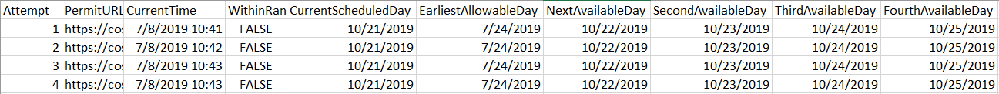

# Seattle_Permitting

## Project Intent

This project was initally created during my time at American Classic Homes during the summer of 2019.

During my internship, the company frequently found themselves in need of checking a [City of Seattle facilitated website](https://cosaccela.seattle.gov/Portal/welcome.aspx) in attempts to schedule permit meeting times with the city. Since these meetings were often very difficult to obtain, saving days on a permit appoitment meant thousands of dollars in saved costs.

After learning this, I set out to automate this process so a computer could check without the need to do it manually.

This project was so successful that at times, it could shave months off of a permit appointment date. Since developer projects are delayed until this point is reached, this meant that I was saving the company tens of thousands of dollars in loan interest for each month I was able to shave off.

## Execution

This repository has a standalone version of the program as well as the original source code. The following explanation is for use with the standalone executable file.

### Program Requirements

1. Create a folder somewhere on your computer, location is unnecessary, just make sure all files are in the same directory.

2. Check and make sure there are the following three necessary files within the folder directory.
    * chromedriver.exe
    * DateCriteria.txt
    * SeattlePermitScheduler.exe

3. If for some reason the DateCriteria.txt file is lost/broken. See the below picture to see the syntax of the file.

The first line should contain the record number landing page URL. If you don’t know the record number landing page URL, go to https://cosaccela.seattle.gov/portal/welcome.aspx and look up the address/record number. The second should contain your earliest allowable day that is in-between today and the next appointment date. The third should contain an integer value which represents how frequent you want the program to check.

Notice how there is a “=” and a “|” between the values for each setting and a “;” at the end of each line (Project URL has the “;” cut-off on the example image). These are all necessary in order for the computer to interpret this file.

4. Before you run the program, ensure that the permit you would like to execute already has an appointment date in the future. The distance doesn’t matter, it just needs one to start with.

### Running The Program

1. Double Click on the SeattlePermitScheduler.exe file. If this is the first time, it may ask you to verify which networks you want to allow this program to be run on. This is normal and should only occur the first time you run it. If your computer/an anti-virus software doesn’t allow you to run this program, try [running it as an administrator.](https://www.itechtics.com/run-programs-administrator/)

2. Give the program 30-60 seconds to boot up, you should see a black command prompt box with a blinking white rectangle.

3. Once it starts, it should launch a chrome browser and start scraping for better dates.

4. After each time the program checks for a new date, a new file called SeattlePermitScheduler.csv should be created. Do not be alarmed, this is just a database of the previous attempts the program has tried. It serves no purpose besides analytical post analysis. If no column labels are attached, see the following image to see what each row means.

5. The program will automatically check and replace the appointment dates with new ones that it finds within your time range.

6. Once you are done with the program, close the black dialogue box and the chrome browser should also close.

### Optimizing the Program

1. I have noticed that a majority of the appointment dates free up in the morning (between 7:00am and 9:00am) so if possible, try and have this program constantly running during those hours for a maximum chance of getting a better appointment date.

### Something Went Wrong

1. While I have seen this program work continuously for hours, I have also seen it stop after minutes. Depending on the day, the website Seattle uses for these permits gets different amounts of internet traffic. This means that our program is also affected by this.

2. If the program stops working or closes itself, this means it has run into some type of error. If/when this happens, the best way to fix it is to just start the program over. It will resume where it left off as if nothing went wrong.

### Known Bugs

1. Although it is very rare, I have seen all four next available appointment days be before your next allowable date. When this occurs, it causes the program to shut down. Since this happens so rarely, I never had an opportunity long enough to try and see what the problem was. If this happens, just wait a couple minutes or so for one of the next available dates to be after your next allowable date and resume running the program.

## Adding an Appointment Documentation

### Program Requirements

1. Create a folder somewhere on your computer, location is unnecessary, just make sure all files are in the same directory.

2. Check and make sure there are the following three necessary files within the folder directory.
    * chromedriver.exe
    * DateCriteria.txt
    * AddAnAppointment.exe

3. If for some reason the DateCriteria.txt file is lost/broken. See the below picture to see the syntax of the file.

The first line should contain the record number landing page URL. If you don’t know the record number landing page URL, go to https://cosaccela.seattle.gov/portal/welcome.aspx and look up the address/record number.

The second should contain your earliest allowable day that is in-between today and the next appointment date. The third should contain an integer value which represents how frequent you want the program to check.

Notice how there is a “=” and a “|” between the values for each setting and a “;” at the end of each line (Project URL has the “;” cut-off on the example image). These are all necessary in order for the computer to interpret this file.

### Running the Program

1. Double Click on the AddAnAppointment.exe file. If this is the first time, it may ask you to verify which networks you want to allow this program to be run on. This is normal and should only occur the first time you run it. If your computer/an anti-virus software doesn’t allow you to run this program, try running it as an administrator.

2. Give the program 30-60 seconds to boot up, you should see a black command prompt box with a blinking white rectangle.

3. Once it starts, it should launch a chrome browser and automatically create another inspection date for the respective permit number associated within the DateCriteria.txt file.

### Known Bugs

1. I have no idea how to remove an appointment, so add them at your own risk.

